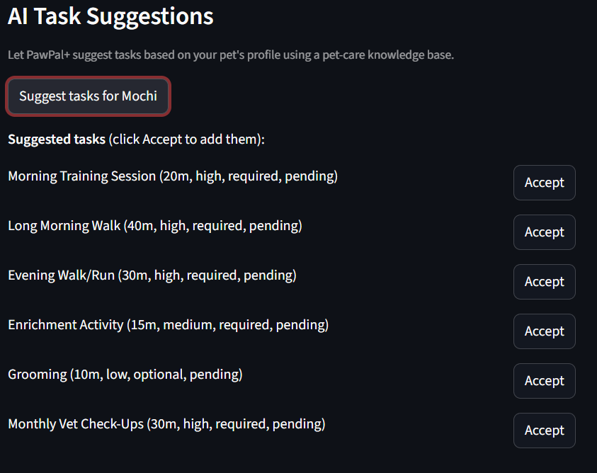
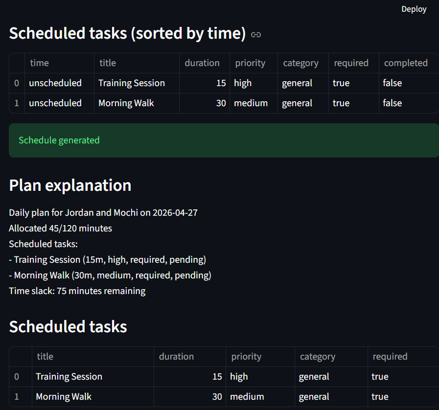
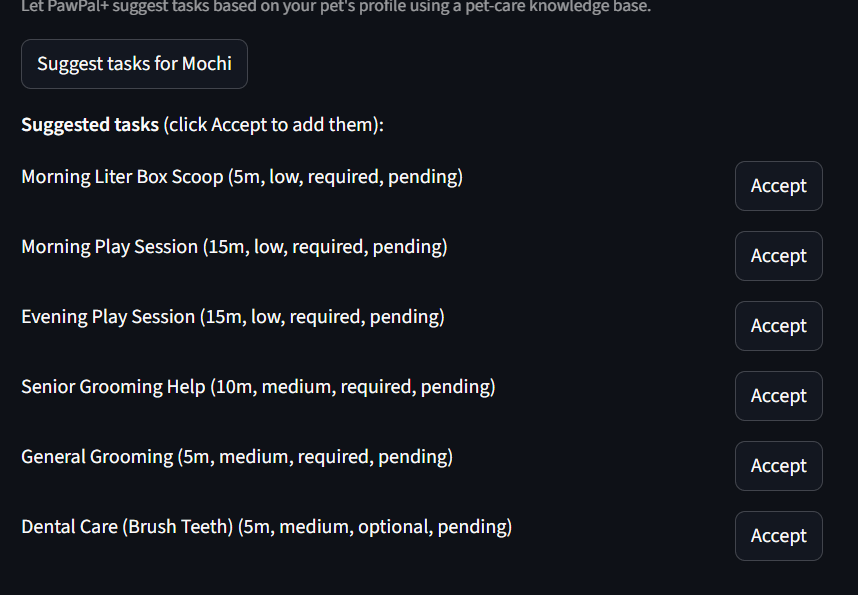
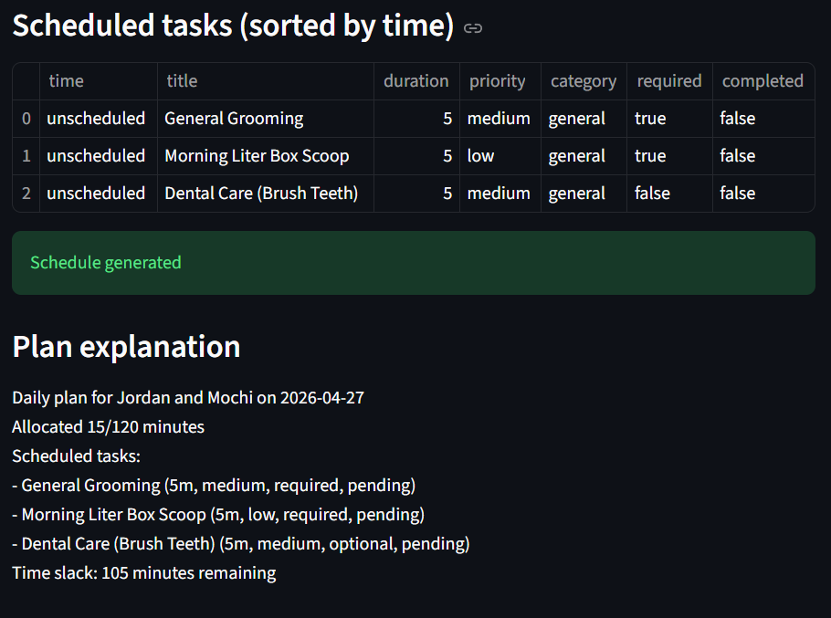

# PawPal+ (Module 2 Project)

You are building **PawPal+**, a Streamlit app that helps a pet owner plan care tasks for their pet.

## Scenario

A busy pet owner needs help staying consistent with pet care. They want an assistant that can:

- Track pet care tasks (walks, feeding, meds, enrichment, grooming, etc.)
- Consider constraints (time available, priority, owner preferences)
- Produce a daily plan and explain why it chose that plan

Your job is to design the system first (UML), then implement the logic in Python, then connect it to the Streamlit UI.

## What you will build

Your final app should:

- Let a user enter basic owner + pet info
- Let a user add/edit tasks (duration + priority at minimum)
- Generate a daily schedule/plan based on constraints and priorities
- Display the plan clearly (and ideally explain the reasoning)
- Include tests for the most important scheduling behaviors

## Features

- Required-first scheduling: required tasks are always attempted first, then optional tasks are added while time remains.
- Priority-based task selection: both required and optional tasks are sorted by priority before scheduling.
- Daily recurrence support: recurring tasks (`daily`, `weekly`) auto-create the next occurrence when completed.
- Chronological task sorting: `sort_by_time` presents tasks by `time` (HH:MM). 
- Conflict detection: `check_conflicts` flags tasks that share the same time slot.
- Complete and task cycling: `mark_task_complete` sets completion, removes task from today's schedule, and enqueues next recurrence if applicable.
- Persistence in the session: the Streamlit UI retains pet/task state and reflects changes immediately.

## Smarter Scheduling

PawPal+ now includes smarter schedule handling that:

- Prioritizes required tasks first and fills remaining time with optional tasks by priority
- Respects `available_minutes_per_day` and raises a clear error when required work exceeds available time
- Supports recurring tasks (`daily`, `weekly`) by auto-enqueuing next occurrences
- Has schedule helpers: mark tasks complete, sort by scheduled time, filter by completed status and pet, and conflict detection

## Getting started

### Setup

```bash
python -m venv .venv
source .venv/bin/activate  # Windows: .venv\Scripts\activate
pip install -r requirements.txt
```

## Testing PawPal+

Run the automated test suite with:

```bash
python -m pytest
```

Current tests cover:
- Task state transitions (`mark_complete`, recurrence enqueue)
- Owner and pet task list management
- Schedule generation respecting required/optional tasks and time constraints
- Sorting tasks chronologically (`sort_by_time`)
- Conflict detection for duplicated task times (`check_conflicts`)

Confidence Level: ⭐⭐⭐⭐⭐ (5/5) based on passing tests and scenario coverage.

### Suggested workflow

1. Read the scenario carefully and identify requirements and edge cases.
2. Draft a UML diagram (classes, attributes, methods, relationships).
3. Convert UML into Python class stubs (no logic yet).
4. Implement scheduling logic in small increments.
5. Add tests to verify key behaviors.
6. Connect your logic to the Streamlit UI in `app.py`.
7. Refine UML so it matches what you actually built.

Demo:


-Pawpal+ Enhanced, a pet task scheduling app with AI recommendations based on pet traits.

-This is a redesigned version of my Pawpal+ project that aims to enhance its currents scheduling functions with the help of a LLM. The original goal of this project was to enable scheduling of tasks related to pet care that mostly relied on manual input. This project aims to enhance that functionality by suggesting tasks based on data regarding the pet entry using a knowdlege based through RAG.


-Here is a mermaid.js diagram of the data flow: , to check results, unit tests were used.


-PawPal+ has two parallel paths that both feed into the scheduler:

RAG Suggestion Path — When a user adds a pet and clicks "Suggest Tasks", the pet's profile (species, age, energy level, etc.) is used to build a query string. That query is run against ChromaDB, which holds paragraph-level chunks from the four knowledge base text files, embedded with sentence-transformers. The top 6 most relevant chunks are retrieved and combined with the pet info into a prompt sent to the Groq API (Llama 3.1). The JSON response is parsed and each task dict is validated before becoming a Task object shown in the UI.

Scheduling Path — Once the user has tasks (either accepted from suggestions or entered manually), clicking "Generate Schedule" passes the owner, pet, and full task list into DailyPlan. It schedules required tasks first sorted by priority, fills remaining time with optional tasks, then sorts by time, detects conflicts, and produces a plain-text explanation — all displayed in the Streamlit UI.

Guardrails sit at every input boundary: free-text fields (owner name, pet name, task title) are validated for length and safe characters before reaching the domain model. Duration and available minutes are range-checked. Pet name and breed are sanitized before being embedded in the LLM prompt to block injection attempts. LLM output is field-by-field validated — bad entries are skipped rather than crashing the app. All failures surface as inline st.error() messages.

## How to Run

**1. Get a free API key**

Go to console.groq.com, sign up, and create an API key. It's free, no credit card needed.

**2. Create a `.env` file**

In your project folder, create a file called `.env` and paste this inside it, replacing the placeholder with your actual key:
```
GROQ_API_KEY=paste-your-key-here
```

**3. Install the required packages**

Open a terminal in your project folder and run:
```
pip install -r requirements.txt
pip install python-dotenv
```
This may take a few minutes the first time since some packages are large.

**4. Start the app**

In the same terminal, run:
```
python -m streamlit run app.py
```
A browser tab will open automatically. If it doesn't, go to `http://localhost:8501`.

---

**Once the app is open:**

1. Type your name and how many minutes you have available today
2. Open the "Add a Pet" section, fill in your pet's details, and click Add Pet
3. Click the "Suggest tasks" button — the app will look up care guidelines for your pet and generate a recommended task list
4. Click Accept on any tasks you want to keep
5. You can also add tasks manually in the Tasks section below
6. Click Generate Schedule to see your finalized daily plan


example output:
some suggested tasks for a 3 year old, high energy dog: 

schedule result: 


suggested tasks for a 12 year old, low energy cat:

resulting schedule: 


-Unit tests were performed to check that functions work properly, including edge cases. A run consisting of 91 tests had all passing results, givings us a confidence score of 1. These were implemented after adding input validations and were not performed before that. 

-Overall, I wanted to retrieve information about common care methods for pets given particular information in order to suggest to the owner tasks that might be relevant to their pet, I wanted kind of a "curated" suggestion list of what could be added as a task, should an owner not know what to write. Guardrails were made to ensure valid inputs and remove time conflicts. Some drawbacks that came from this was that the suggestions were limited to a knowledge file containing common tasks, so there is little variance of the suggested tasks once used enough within the same category. 

-Testing worked for all functions, however from manual testing, once tasks were added to a point that the available time a pet owner has chosen was not enough, there is no simple way to remove tasks once they are added to the task schedule plan. Stricly from what didnt work at first was using some AI models that required tokens to be used, which made me revert into using models that had free plans in them. A silent error happened where the schedule sorted by time was empty, and a section of plan explanations was duplicated. 

-overall, this project has taught me how to leverage RAG more effectively to avoid relying on strict manual input, letting AI make suggestions based on stored information about a particular topic. 


short reflection: 

This project shows that I approach AI integration pragmatically. I didn't add RAG because it was trendy, but because there was a real gap between what users knew to type and what their pet actually needed. I chose to build guardrails before the system was broken which reflects how I think about reliability: prevention over recovery. 
